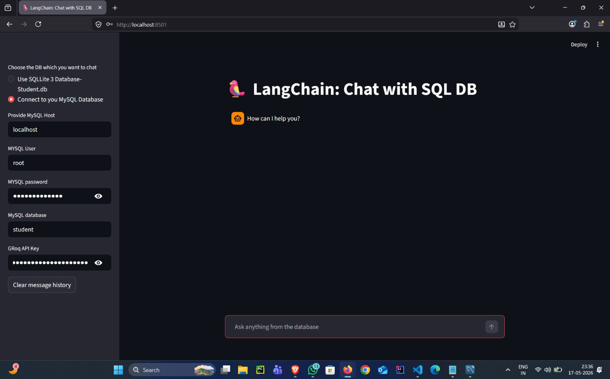
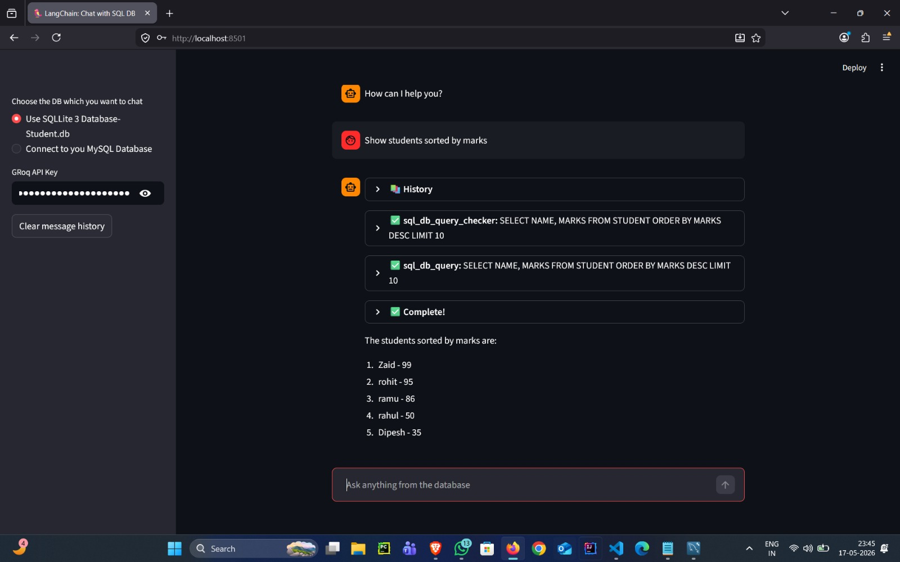
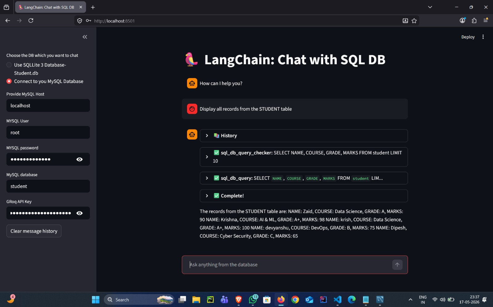

# 🦜 LangChain SQL Chat Agent

An AI-powered SQL chatbot built using **LangChain**, **Streamlit**, **Groq LLMs**, **SQLite**, and **MySQL**.

This application allows users to chat with databases using natural language queries.  
The AI agent automatically generates SQL queries, executes them, and returns results in a conversational format.

---

# 🚀 Features

- Chat with SQLite databases
- Chat with MySQL databases
- AI-generated SQL queries
- Natural language to SQL conversion
- LangChain SQL Agent integration
- Streamlit interactive UI
- Tool execution visibility
- Supports Groq LLMs
- Real-time agent reasoning steps

---

# 🛠️ Tech Stack

- Python
- Streamlit
- LangChain
- LangChain Community
- Groq API
- SQLite
- MySQL
- SQLAlchemy

---

# 📂 Project Structure

```bash
10-langchain-sql-chat-agent/
│
├── database/
│   ├── create_student_db.py
│   └── student.db
│
├── screenshots/
│   ├── 0-sqlite-database-chat.png
│   ├── 1-app-home-screen.png
│   └── 2-mysql-database-chat.png
│
├── app.py
├── requirements.txt
├── .gitignore
└── README.md
```

---

# ⚙️ Installation

## 1 Clone the Repository

```bash
git clone https://github.com/shaik-zaid/langchain-sql-chat-agent.git
cd langchain-sql-chat-agent
```

---

## 2 Create Virtual Environment

```bash
python -m venv venv
```

### Activate Environment

#### Windows

```bash
venv\Scripts\activate
```

#### Mac/Linux

```bash
source venv/bin/activate
```

---

## 3 Install Requirements

```bash
pip install -r requirements.txt
```

---

# 🔑 Setup Environment Variables

Create a `.env` file:

```env
GROQ_API_KEY=your_groq_api_key
```

Or directly enter the API key in the Streamlit sidebar.

---

# ▶️ Run the Application

```bash
streamlit run app.py
```

---

# 🗄️ SQLite Database Setup

The project includes a sample student database.

To recreate the database:

```bash
python database/create_student_db.py
```

---

# 🧠 Example Questions

```text
Show all students
```

```text
Who scored the highest marks?
```

```text
Show students sorted by marks
```

```text
What is the average marks?
```

```text
Display all records from the STUDENT table
```

```text
Which students are in Data Science course?
```

---

# 📸 Screenshots

## 🏠 Home Screen



---

## 🗃️ SQLite Database Chat



---

## 🐬 MySQL Database Chat



---

# 🔍 How It Works

1. User enters a natural language query
2. LangChain SQL Agent analyzes the query
3. Agent generates SQL statements
4. SQL executes on the selected database
5. Results are returned in conversational format

---

# 📦 Requirements

Main libraries used:

```text
streamlit
langchain
langchain-community
langchain-groq
sqlalchemy
mysql-connector-python
```

---

# 📌 Future Improvements

- CSV upload support
- PostgreSQL support
- Query history storage
- Authentication system
- Multi-table database support
- Data visualization dashboard

---

# 👨‍💻 Author

Shaik Zaid

---

# ⭐ If you like this project

Give this repository a star ⭐